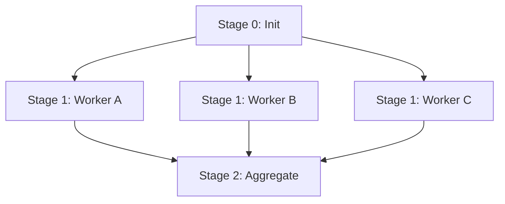

# genpark-parallel-subtask-wavefront-scheduler-skill

Wavefront parallel execution scheduler grouping interdependent DAG agent tasks into concurrent stages.

## Architecture

## Features
- **Maximized Concurrency**: Identifies all tasks whose prerequisites are complete.
- **Stage Isolation**: Enforces synchronization barriers between wavefronts.
